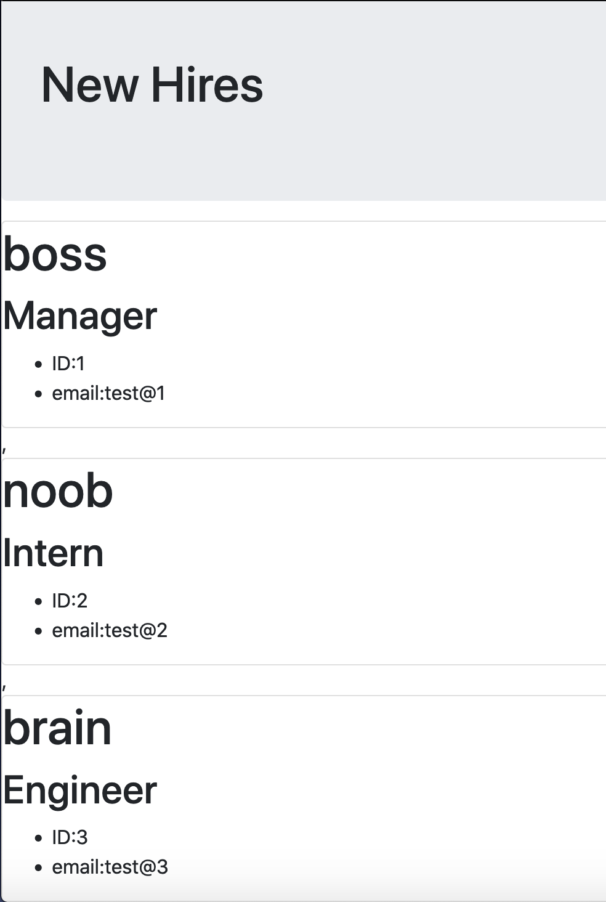
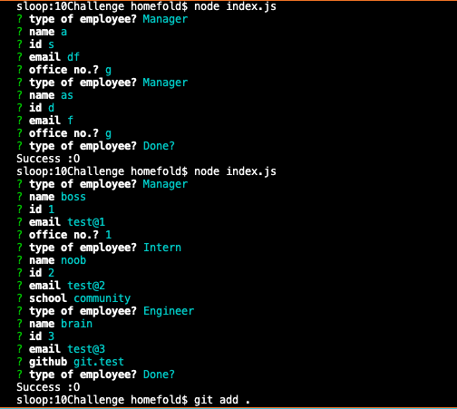

### 

## GitHub Link: https://levmerka.github.io/10_Our_New_Team_Generator/

# Team Builder HTML Generator

## Table of Contents:

- [Description](#description)
- [Installation](#installation)
- [Usage](#usage)
- [Contributors](#contributing)
- [Tests](#tests)
- [Questions](#questions)

## Description

This application uses node inquirer and JavaScipt to create an HTML page displaying various new hires based on responses given by the user in the terminal. First run Node to get prompted with the questionnaire. After answering the prompts, and clicking `Done?`, an HTML page is generated and populated with the data provided.

 

## Installation

You will need npm inquirer for the question prompts and Jest for testing
npm i inquirer

## Usage

use free
run node as shown:

 

## Contributing

my tutor Jack Linhart , AskBCS

## Tests

Jest was used for all testing of properties and methods of the inital children

 

## Questions?

If there are any questions please reach out to: lev@merka.us
